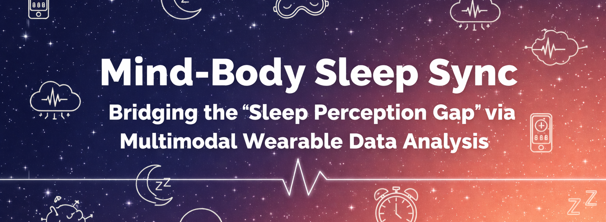

# Mind-Body Sleep Sync: Bridging the "Sleep Perception Gap"

## 📄 Executive Summary
This project addresses the growing issue of **"Orthosomnia"**—the anxiety or disconnect users feel between their tracked health metrics and their actual perceived well-being. By analyzing the statistical gap between **Objective Recovery** (Fitbit data) and **Subjective Fatigue** (Self-report surveys), this project develops a **"Cognitive Sleep Coach"** framework. The goal is to move beyond simple tracking to provide personalized cognitive reframing, validating user feelings while offering biological "Ground Truth" to improve daily vitality and user retention.

## 🎯 Business Objectives
1. **Solve the "So What?" Problem**: Validate subjective feelings to make data actionable, reducing churn among users who feel their device is "inaccurate".
2. **Increase Daily Active Users (DAU)**: Transform the app into a tool users check for permission to feel good (Reassurance) or guidance to rest (Warning), rather than just a passive tracker.
3. **Wellness Expansion**: Position the product as a mental health tool, opening a new market for stress-management features alongside fitness tracking.

## 📊 Data Sources
The analysis utilizes a **multi-modal dataset** aligning wearable sensor data with daily self-reported logs:

- **Objective Metrics (Ground Truth)**:

  - `main_sleep_efficiency`: Sleep Density (Time asleep / Time in bed).

  - `HRV` (Heart Rate Variability): Key marker for stress resilience.

  - `main_sleep_rem_minutes` & `deep_minutes`: Architecture for mental/physical recovery.

- **Subjective Metrics (Perception)**:

  - `selfreport_sleep_quality`: Likert Scale satisfaction.

  - `selfreport_hours_slept`: Compared against actual time to quantify "Time Perception Distortion."

- **Target Variables**: energy_morning (Primary Outcome) and stress_morning.

## 🛠 Tech Stack
- **Python**: Core analytical engine.
- **Pandas & NumPy**: Data cleaning, timestamp alignment, and Z-score normalization.
- **Plotly Express**: Interactive "Mood vs. Metrics" visualizations.
- **SciPy.stats**: Statistical correlation analysis.

## 💡 Key Insights & Recommendations
- **The "Warning Mode" (High Energy / Low Battery)**: Identified users who feel energetic despite empty biological batteries.
  **Recommendation**: Flag these days to warn against high-intensity training to prevent injury.
- **The "Maintenance Mode" (The Sync)**: Instances where data aligns with perception.
  **Recommendation**: Reinforce these streaks with positive feedback ("Mind and body are in sync").
- **Paradoxical Insomnia**: Defined the specific user segment suffering from "Orthosomnia" (feeling tired despite "green" data), requiring psychological reframing rather than standard sleep hygiene tips.
